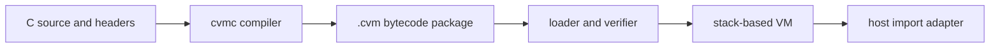
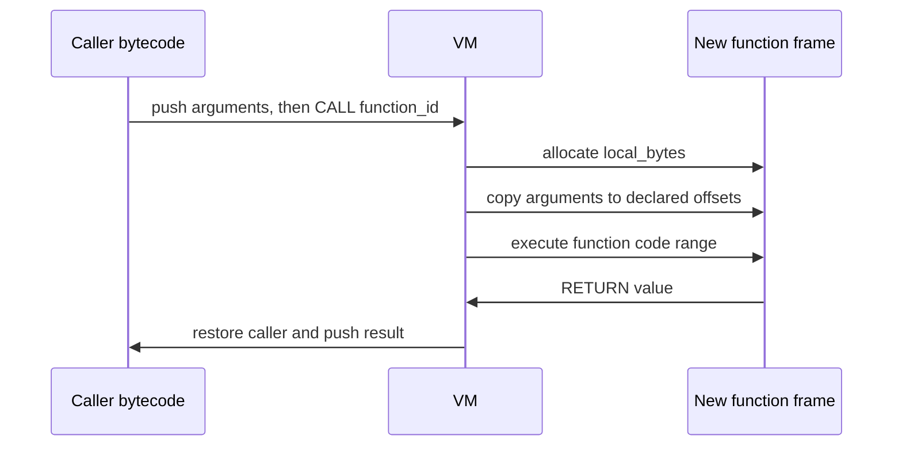
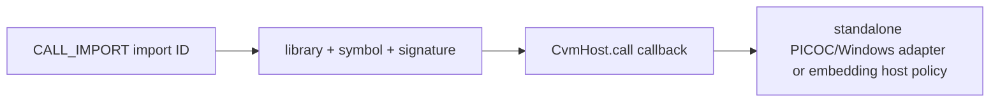

# Cobalt PicoC VM

[简体中文](README.zh-CN.md)

Cobalt PicoC VM is a standalone C-to-bytecode compiler and a small bytecode
virtual machine. The compiler reads `.c` files and controlled headers. The VM
loads the resulting `.cvm` package, verifies it, and executes it without
receiving or parsing the original source.

This repository is an independent implementation. It is not the official
Cobalt Strike Beacon Interpreter.

## Current status

The complete checked-in pipeline is working on Windows x86 and x64:



The current release:

- compiles a practical PicoC-compatible C subset to deterministic bytecode;
- runs the bytecode in a separate C runtime with no C parser;
- validates package structure, control flow, stack depth, indices, memory
  ranges, and resource declarations before execution;
- provides a symbolic host-call boundary used by `cvmrun` for PicoC library
  functions;
- supports BOF-style DFR declarations, official interpreter headers, loader
  APIs, and typed native function pointers through one validated ABI boundary;
- passes 94 project-specific checks, the native FFI gate, and all 67 validated root PicoC fixtures
  independently on both x86 and x64.

The compiler emits x86 or x64 `picoc-compat` or `beacon` packages from either compiler
binary. The build produces native 32-bit and 64-bit VMs, and each VM rejects
packages for the other architecture before execution. Native calls support
x86 `cdecl`/`stdcall` and the Windows x64 ABI. Relocations, debug data, and
checksums remain reserved. Symbol resolution and memory policy intentionally
remain host responsibilities rather than being hard-coded into the VM.

## Build and quick start

Requirements:

- Windows 10 or later;
- Visual Studio 2022 C++ tools and Windows SDK;
- Clang/Clang++ available as `clang` and `clang++`;
- Python 3 for the test harness.

Build:

```powershell
.\build.ps1
```

Compile and run a script:

```powershell
.\build\x64\cvmc.exe .\tests\add.c .\build\x64\add.cvm
.\build\x64\cvmrun.exe --print-result .\build\x64\add.cvm
```

The second command prints `5`. Script arguments follow the package path:

```powershell
.\build\x64\cvmrun.exe script.cvm - arg1 arg2
```

The first `-` is an ordinary script argument and mirrors the PicoC argument
fixture. To inspect preprocessor output:

```powershell
.\build\x64\cvmc.exe input.c -E
```

To reduce the execution budget:

```powershell
.\build\x64\cvmrun.exe --instruction-budget 100000 script.cvm
```

Each compiler defaults to its own process architecture. Either compiler can
also cross-emit a package explicitly:

```powershell
.\build\x64\cvmc.exe --target x86 input.c output-x86.cvm
.\build\x86\cvmrun.exe output-x86.cvm
```

The accepted target names are `x86`/`win32` and `x64`/`win64`.

Run every release check:

```powershell
.\test.ps1
```

## Repository layout

| Path | Purpose |
|---|---|
| `include/cvm/format.h` | Stable package records, section IDs, value types, targets, profiles, and calling-convention IDs |
| `include/cvm/opcode.h` | Version 1 instruction set and fixed instruction record |
| `include/cvm/runtime.h` | Embedding API, limits, diagnostics, host calls, and host memory policy |
| `src/compiler/cvmc.cpp` | Preprocessor, lexer, parser, type layout, bytecode emitter, and package writer |
| `src/runtime/runtime.c` | Package loader, verifier, VM, memory checks, and execution limits |
| `src/tools/cvmrun.c` | Standalone runner and PicoC compatibility host adapter |
| `tests/extended` | Positive, negative, runtime-failure, and explicit unsupported contracts |
| `tests/upstream-picoc` | Vendored PicoC compatibility and stress corpus |
| `tools` | Regression, mutation, reproducibility, property, and native differential harnesses |
| `docs` | Requirements, architecture, and testing rationale |

The PicoC corpus keeps its original license in
`tests/upstream-picoc/LICENSE`. See [THIRD_PARTY_NOTICES.md](THIRD_PARTY_NOTICES.md).

## Build products

The build directory is generated and is intentionally not committed.
The 32-bit directory is named `x86`, not `x32`, to match Windows toolchain and
PE architecture naming. Architecture-specific source directories are avoided;
both targets compile the same compiler and runtime sources.

| Product | Created by | Purpose |
|---|---|---|
| `build/x86/cvmc.exe`, `build/x64/cvmc.exe` | `build.ps1` | Native 32/64-bit compiler tools; both can emit either target with `--target` |
| `build/x86/cvmrun.exe`, `build/x64/cvmrun.exe` | `build.ps1` | Native target VM and standalone host adapter |
| `build/<arch>/smoke_vm.exe` | `build.ps1` | Target-native public API and malformed-package smoke test |
| `build/<arch>/add.cvm` | `build.ps1` | Target-specific end-to-end sample package; its result must be `5` |
| `build/<arch>/extended-test-report.json` | `test.ps1` | Machine-readable result for 94 target-specific secondary checks |
| `build/<arch>/extended-test-report.md` | `test.ps1` | Human-readable target-specific secondary report |
| `build/<arch>/picoc-test-report.json` | `test.ps1` | Per-fixture result for 67 target-specific compatibility tests |
| `build/architecture-test-report.json` | `test.ps1` | PE architecture, layout, cross-emission, and cross-runtime isolation checks |

Native executables used for differential tests are temporary test products,
not release artifacts.

## Supported C behavior

The compiler currently covers the behavior exercised by the published tests:

- local, global, and static storage;
- `char`, `short`, `int`, `long`, `long long`, signed and unsigned values;
- PicoC-compatible floating-point expressions using the VM `F64` cell;
- pointers, arrays, pointer arithmetic, strings, `struct`, `union`, `enum`,
  and `typedef`;
- functions, prototypes, recursion, parameters, return values, and `main`
  arguments;
- expressions, casts, `sizeof`, prefix/postfix operators, and short-circuit
  evaluation;
- `if`, `switch`, `for`, `while`, `do`, `break`, `continue`, and `goto`;
- aggregate and array initialization;
- local includes, object-like and function-like macros, conditional
  preprocessing, `defined`, macro replacement, and macro removal;
- BOF-style declarations such as
  `KERNEL32$LoadLibraryA: ptr (ptr);`, including explicit `cdecl`,
  `stdcall`, integer/pointer atoms, and cdecl variadic signatures;
- typed native function pointers populated at runtime, including the
  documented `GetProcAddress` pattern;
- PicoC compatibility imports for tested console, string, memory-copy, math,
  and file operations.

Current explicit limits:

- target names are currently limited to Windows x86 and Windows x64;
- script-defined function pointers/callbacks are rejected; typed pointers to
  resolved native functions are supported;
- designated initializers are rejected;
- the standalone `cvmrun` host resolves its supported `PICOC` imports plus
  Windows loader/DFR symbols; a Beacon embedding supplies the `BEACON$` and
  `INTERNAL$` policy;
- native floating-point and aggregate-by-value ABI calls are outside the DFR
  atom contract;
- the repository does not include a Java Teamserver service;
- checksum generation/validation and relocation/debug sections are reserved;
- the verifier protects VM-owned memory and host-approved ranges; it does not
  make undefined C behavior safe in general.

Unsupported syntax has rejection tests. It is not counted as implemented.

## Package format version 1

All integer fields are little-endian. A package begins with a 44-byte
`CvmPackageHeader`, followed by `section_count` 20-byte directory entries and
then section payloads.

```text
lower file offset
┌──────────────────────────────────────────────┐
│ CvmPackageHeader (44 bytes)                  │
├──────────────────────────────────────────────┤
│ CvmSectionHeader[section_count] (20 bytes ea)│
├──────────────────────────────────────────────┤
│ strings: NUL-terminated names                │
├──────────────────────────────────────────────┤
│ data: string literals and initial bytes      │
├──────────────────────────────────────────────┤
│ parameters: names, types, frame offsets      │
├──────────────────────────────────────────────┤
│ functions: code ranges and frame sizes       │
├──────────────────────────────────────────────┤
│ code: fixed 12-byte instructions             │
├──────────────────────────────────────────────┤
│ imports and native signatures                │
└──────────────────────────────────────────────┘
higher file offset
```

The compiler writes eight required sections in version 1:

| Section | ID | Contents |
|---|---:|---|
| Strings | 1 | Function, parameter, library, and symbol names |
| Data | 3 | Read-only constant bytes used by the running module |
| Parameters | 6 | `CvmParameter` entries, including frame offsets |
| Functions | 5 | `CvmFunction` entries and code/frame bounds |
| Code | 7 | `CvmInstruction` array |
| Imports | 8 | Symbolic library/name references and signature IDs |
| Signatures | 9 | Return type, parameter range, and calling convention |
| Signature parameters | 10 | Packed `CvmValueType` IDs |

Constants (2), globals (4), relocations (11), and debug data (12) have assigned
section IDs for format evolution. The current writer stores mutable global
size in the header and emits initialization stores in the entry code instead
of emitting a Globals descriptor section.

Important header fields:

| Field | Meaning |
|---|---|
| `magic`, `format_major`, `format_minor` | File identity and compatibility version |
| `target_arch`, `pointer_size`, `endian`, `profile` | Required execution data model |
| `features` | Reserved feature mask; current compiler writes zero |
| `section_count`, `package_size` | Directory length and exact package size |
| `entry_function` | Function table index executed first |
| `global_bytes` | Mutable global allocation size |
| `required_stack_cells`, `required_call_depth` | Package resource claims checked against host limits |
| `checksum` | Reserved; current compiler writes zero |

Serialized references are offsets or table indices. A compiler-process pointer
is never written into the package.

### Instruction record

Every instruction is 12 bytes:

```c
struct CvmInstruction {
    uint8_t  opcode;
    uint8_t  type;
    uint16_t flags;
    int32_t  a;
    int32_t  b;
};
```

`type` is a `CvmValueType` when the operation is typed. `a` and `b` hold an
index, offset, branch target, element size, argument count, or the two halves
of an immediate value, depending on the opcode. Fixed-width records make
boundary and branch validation simple.

Value types are `VOID`, `I8`, `U8`, `I16`, `U16`, `I32`, `U32`, `I64`, `U64`,
`F32`, `F64`, `PTR`, `CSTR`, and `SIZE`. Calling-convention metadata values are
`DEFAULT`, `CDECL`, `STDCALL`, `WIN64`, and `VM`. Metadata support does not by
itself select an address; the Windows adapter performs the integer/pointer atom
contract for x86 `cdecl`/`stdcall` and Win64 after host symbol resolution.

## Instruction set

All version 1 instructions below are implemented by the runtime. Some
instructions are format/runtime capabilities that the current compiler does
not need to emit for every source form.

| Group | Opcodes | Purpose |
|---|---|---|
| Control | `NOP`, `HALT` | No operation and stop execution |
| Stack/constants | `PUSH_IMMEDIATE`, `PUSH_CONSTANT_ADDRESS`, `POP`, `DUP`, `SWAP` | Create and rearrange operand values |
| Addresses | `ADDRESS_ARGUMENT`, `ADDRESS_LOCAL`, `ADDRESS_GLOBAL`, `ADDRESS_DATA`, `POINTER_ADD`, `POINTER_INDEX` | Compute checked object addresses |
| Memory | `LOAD`, `STORE`, `COPY_BYTES` | Typed reads, typed writes, and aggregate copies |
| Arithmetic | `ADD`, `SUBTRACT`, `MULTIPLY`, `DIVIDE_SIGNED`, `DIVIDE_UNSIGNED`, `MODULO_SIGNED`, `MODULO_UNSIGNED`, `NEGATE` | Integer or floating-point arithmetic selected by `type` |
| Bits/logic | `BIT_AND`, `BIT_OR`, `BIT_XOR`, `BIT_NOT`, `LOGICAL_AND`, `LOGICAL_OR`, `SHIFT_LEFT`, `SHIFT_RIGHT_SIGNED`, `SHIFT_RIGHT_UNSIGNED` | Bit, Boolean, and shift operations |
| Comparison | `COMPARE_EQUAL`, `COMPARE_NOT_EQUAL`, `COMPARE_LESS_SIGNED`, `COMPARE_LESS_UNSIGNED`, `COMPARE_LESS_EQUAL_SIGNED`, `COMPARE_LESS_EQUAL_UNSIGNED`, `COMPARE_GREATER_SIGNED`, `COMPARE_GREATER_UNSIGNED`, `COMPARE_GREATER_EQUAL_SIGNED`, `COMPARE_GREATER_EQUAL_UNSIGNED` | Produce an integer Boolean result |
| Conversion | `CONVERT` | Convert between declared VM value types |
| Branch | `JUMP`, `JUMP_IF_ZERO`, `JUMP_IF_NONZERO` | Validated control flow within one function |
| Calls | `CALL`, `RETURN`, `CALL_IMPORT` | VM calls, returns, and symbolic host calls |
| Native indirect | `CALL_NATIVE_INDIRECT` | Typed call through a runtime address with a validated signature |

The compiler lowers C `&&` and `||` to conditional branches when it must
preserve short-circuit behavior. Opcode presence is not a promise that the
compiler emits that opcode for every equivalent C expression.

## Runtime memory layout

The VM does not use native executable memory. Package code remains data read by
the interpreter.

```text
one loaded CvmModule
┌──────────────────────────────────────────────────────────┐
│ package copy (immutable)                                 │
│ header | section directory | strings | data | code | ... │
└──────────────────────────────────────────────────────────┘
┌──────────────────────────────────────────────────────────┐
│ globals (mutable, zero-initialized, global_bytes)        │
└──────────────────────────────────────────────────────────┘

one CvmExecution
┌──────────────────────────────────────────────────────────┐
│ operand stack: CvmValue[maximum_stack_cells]             │
│ each cell is 8 bytes                                     │
├──────────────────────────────────────────────────────────┤
│ frame 0 storage: parameters at declared offsets | locals │
│ frame 1 storage: parameters at declared offsets | locals │
│ ... bounded by maximum_call_depth                        │
├──────────────────────────────────────────────────────────┤
│ optional foreign ranges approved by host memory policy   │
└──────────────────────────────────────────────────────────┘
```

Each VM function owns a `local_bytes` frame. Parameter descriptors provide the
byte offset used when call arguments are copied into the new frame. Compiler
assigned local offsets share the same frame. VM function calls do not use the
platform C calling convention.

Pointers inside a running package use the selected target width: 4 bytes on
x86 and 8 bytes on x64. Their values are runtime addresses to package data,
globals, frame storage, or a host-approved range. Load, store, and copy
operations check that the complete access belongs to one of those ranges.
Addresses are created only after loading; package files contain offsets and
IDs, never those addresses.

### Function call



### Host import



The package identifies an import by strings and a validated signature. It does
not contain a DLL address or function pointer. The host decides whether and
how to resolve the name. A typed indirect call receives its address only at
runtime, normally from `GetProcAddress`, while its signature remains verified
package metadata.

## Verification and execution limits

The loader checks:

- magic, version, little-endian marker, target/pointer pairing, and exact file
  size;
- section directory bounds, payload bounds, duplicates, overlap, entry sizes,
  and unknown required sections;
- function, parameter, import, signature, string, and entry indices;
- code ranges, branch containment, typed load/store operands, call arity, and
  return compatibility;
- stack underflow, stack depth at control-flow joins, declared maximum stack,
  globals, locals, call depth, and native argument limits.

Default host limits:

| Limit | Default |
|---|---:|
| Instructions per execution | 10,000,000 |
| Operand stack | 4,096 cells |
| Call depth | 128 frames |
| Local bytes per function | 1 MiB |
| Global bytes | 4 MiB |
| Host-call arguments | 32 |

An embedding host can lower these limits before loading a package.

## Tests

`test.ps1` rebuilds from source and runs the following separately on x86 and
x64:

- runtime API smoke tests and malformed packages;
- 13 semantic programs;
- 13 byte-for-byte deterministic rebuild checks;
- 13 checks that source text is not embedded in bytecode;
- 11 native Clang differential programs;
- 8 required compiler failures;
- 4 required runtime failures;
- 2 explicit unsupported-feature failures;
- 26 independent package mutations;
- 168 generated expression properties and one generated array/loop workload;
- symbolic import/signature inspection and compiler-emitted opcode coverage;
- all 67 root PicoC compatibility fixtures.

It then runs 15 cross-architecture checks covering native PE machine types,
package target metadata, pointer/aggregate/array layout, parameter frame
offsets, deterministic cross-emission, invalid target names, and rejection of
x86 packages by x64 VMs and vice versa. The passing release gate is therefore
`94 + 67` checks per architecture, plus the native FFI gate, 15 architecture
checks, and the native smoke pipelines.

The vendored directory also contains 111 Csmith programs and one linked-list
fixture for future compatibility work. They are retained so contributors can
expand coverage without finding a separate PicoC checkout. They are not
included in the current passing release claim.

Run a particular root fixture:

```powershell
python .\tools\run_picoc_tests.py --filter 25_quicksort
```

Use a different fixture directory:

```powershell
python .\tools\run_picoc_tests.py --suite .\tests\upstream-picoc\csmith
```

The harness runs file-writing programs in an isolated temporary directory and
reports compile, runtime, and output failures separately. See
[docs/testing.md](docs/testing.md) for the coverage and anti-target-fitting
rules.

## Embedding the runtime

The runtime is plain C and has three main operations:

```c
CvmLimits limits = cvm_default_limits();
CvmModule *module = NULL;
CvmDiagnostic diagnostic = {0};
CvmValue result = {0};

CvmStatus status = cvm_module_load(
    package_bytes, package_size, &limits, &module, &diagnostic);

if (status == CVM_STATUS_OK) {
    CvmHost host = { host_context, host_call, host_memory_access };
    status = cvm_module_execute(module, &host, &result, &diagnostic);
}

cvm_module_destroy(module);
```

`CvmHost.call` receives a library name, symbol, return type, parameter types,
calling convention, and values. `CvmHost.memory_access` is optional and should
approve only narrow host-owned ranges. Passing `NULL` denies foreign memory.

For a Teamserver/Beacon integration, the boundary is:

1. the Teamserver runs `cvmc` and sends only the `.cvm` bytes;
2. Beacon embeds `runtime.c`;
3. a Beacon-specific `CvmHost.call` resolves allowed symbols and delegates to
   `cvm_native_invoke_windows`;
4. a Beacon-specific memory callback exposes only buffers required by the
   approved API call.

DFR syntax and the x86/x64 native ABI adapter are implemented in this
repository. The embedding application remains responsible for its import
allow-list, Beacon allocator/output bindings, command framing, and transport.
The package format keeps those product-specific concerns outside the C parser
and VM instruction loop.

## Extending the project

When adding an opcode:

1. add it to `include/cvm/opcode.h` without renumbering existing version 1
   values;
2. define verifier stack requirements and valid operand/type combinations;
3. implement runtime behavior and all error paths;
4. add compiler lowering only after the runtime contract exists;
5. add a positive semantic test and malformed-package tests.

When changing the package:

- append optional fields or sections when version 1 readers can safely skip
  them;
- use a new major format version for incompatible record or opcode changes;
- serialize offsets and IDs, never process addresses or C/C++ object layouts;
- document resource and validation rules before accepting the new data.

New language behavior belongs in `tests/extended/positive`; rejected invalid
programs belong in `negative`; execution-policy failures belong in
`runtime_failure`; intentionally unsupported syntax belongs in `unsupported`.
A feature moves out of `unsupported` only when it has a positive result and
format/runtime coverage.

More detail is available in [docs/architecture.md](docs/architecture.md),
[docs/requirements.md](docs/requirements.md), and
[docs/testing.md](docs/testing.md).
