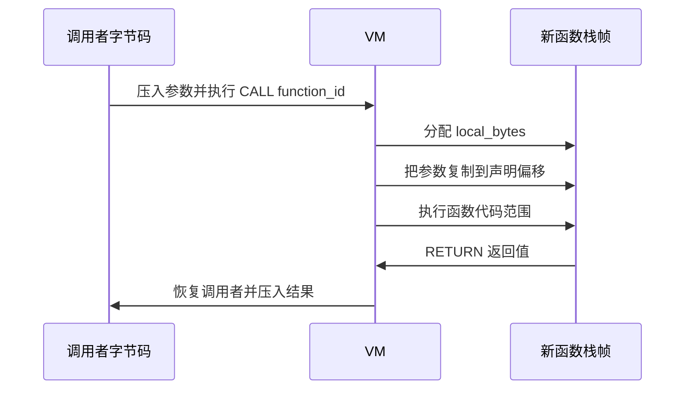
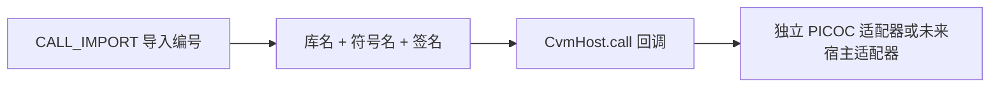

# Cobalt PicoC VM

[English](README.md)

Cobalt PicoC VM 由一个独立的 C 字节码编译器和一个小型字节码虚拟机组成。
编译器读取 `.c` 源文件及受控头文件，生成 `.cvm` 包。VM 只接收字节码包，
先校验再执行，不需要接收或解析原始 C 代码。

本项目是独立实现，不是 Cobalt Strike 官方 Beacon Interpreter。

## 当前状态

目前仓库里的完整链路已经能在 Windows x86 和 x64 上工作：


当前版本能够：

- 把实用的 PicoC 兼容 C 子集编译成结果稳定的字节码；
- 使用完全独立的 C 运行时执行字节码，运行时不包含 C 解析器；
- 执行前校验包结构、控制流、栈深度、索引、内存范围和资源声明；
- 通过符号化宿主调用接口，为 `cvmrun` 提供 PicoC 库函数；
- x86 和 x64 分别通过 95 项项目测试及 67 个 PicoC 根目录兼容用例。

32 位或 64 位编译器都可以生成 x86、x64 `picoc-compat` 包。构建会产出
原生 32 位和 64 位 VM，而且每个 VM 都会在执行前拒绝另一种架构的包。
格式仍为 Beacon 配置、间接原生调用、重定位、调试信息和校验和预留位置。
这个版本不包含 Win32 API 解析、Beacon、BOF、Teamserver、DFR 声明和
原生 ABI 调用适配器。

## 构建和快速使用

环境要求：

- Windows 10 或更高版本；
- Visual Studio 2022 C++ 工具和 Windows SDK；
- 命令行可用 `clang` 和 `clang++`；
- 使用 Python 3 运行测试。

构建：

```powershell
.\build.ps1
```

编译并运行脚本：

```powershell
.\build\x64\cvmc.exe .\tests\add.c .\build\x64\add.cvm
.\build\x64\cvmrun.exe --print-result .\build\x64\add.cvm
```

第二条命令输出 `5`。脚本参数放在字节码包路径后：

```powershell
.\build\x64\cvmrun.exe script.cvm - arg1 arg2
```

这里第一个 `-` 也是脚本参数，用于保持 PicoC 参数测试的行为。查看预处理结果：

```powershell
.\build\x64\cvmc.exe input.c -E
```

降低单次执行的指令预算：

```powershell
.\build\x64\cvmrun.exe --instruction-budget 100000 script.cvm
```

每个编译器默认生成与自身进程架构相同的包，也可以明确跨目标生成：

```powershell
.\build\x64\cvmc.exe --target x86 input.c output-x86.cvm
.\build\x86\cvmrun.exe output-x86.cvm
```

支持的目标名称是 `x86`/`win32` 和 `x64`/`win64`。

运行全部发布检查：

```powershell
.\test.ps1
```

## 仓库目录

| 路径 | 作用 |
|---|---|
| `include/cvm/format.h` | 稳定的包结构、分区编号、值类型、目标架构、配置和调用约定编号 |
| `include/cvm/opcode.h` | 第 1 版指令集和定长指令结构 |
| `include/cvm/runtime.h` | 嵌入接口、资源限制、错误信息、宿主调用和宿主内存策略 |
| `src/compiler/cvmc.cpp` | 预处理、词法、语法、类型布局、字节码生成和写包 |
| `src/runtime/runtime.c` | 包加载、校验、VM、内存检查和执行限制 |
| `src/tools/cvmrun.c` | 独立运行器和 PicoC 兼容宿主适配器 |
| `tests/extended` | 正常、编译失败、运行失败和明确不支持的测试 |
| `tests/upstream-picoc` | 随仓库提供的 PicoC 兼容及压力测试语料 |
| `tools` | 回归、包变异、可重复性、属性和原生编译器对照测试 |
| `docs` | 需求、架构和测试依据 |

PicoC 测试语料的原许可证保存在
`tests/upstream-picoc/LICENSE`，另见
[THIRD_PARTY_NOTICES.md](THIRD_PARTY_NOTICES.md)。

## 构建产物

`build` 是生成目录，不提交到 Git。
32 位目录命名为 `x86` 而不是 `x32`，与 Windows 工具链和 PE 架构名称保持
一致。源码不按架构复制，两个目标使用同一套编译器和运行时源码。

| 产物 | 生成命令 | 作用 |
|---|---|---|
| `build/x86/cvmc.exe`、`build/x64/cvmc.exe` | `build.ps1` | 原生 32/64 位编译器，都能通过 `--target` 生成任一目标 |
| `build/x86/cvmrun.exe`、`build/x64/cvmrun.exe` | `build.ps1` | 对应架构的原生 VM 和独立宿主适配器 |
| `build/<arch>/smoke_vm.exe` | `build.ps1` | 对应架构的公开接口和错误包冒烟测试 |
| `build/<arch>/add.cvm` | `build.ps1` | 对应架构的端到端示例包，结果必须为 `5` |
| `build/<arch>/extended-test-report.json` | `test.ps1` | 95 项对应架构二次测试的机器可读结果 |
| `build/<arch>/extended-test-report.md` | `test.ps1` | 95 项对应架构二次测试的人类可读报告 |
| `build/<arch>/picoc-test-report.json` | `test.ps1` | 67 个对应架构兼容用例的逐项结果 |
| `build/architecture-test-report.json` | `test.ps1` | PE 架构、布局、跨目标生成和跨架构隔离测试 |

原生编译器对照测试产生的可执行文件只是临时测试产物，不属于发布文件。

## 当前支持的 C 能力

编译器目前覆盖公开测试实际使用的能力：

- 局部、全局和静态存储；
- `char`、`short`、`int`、`long`、`long long` 及有符号、无符号整数；
- 使用 VM `F64` 单元实现 PicoC 兼容浮点运算；
- 指针、数组、指针运算、字符串、`struct`、`union`、`enum` 和 `typedef`；
- 函数、函数声明、递归、参数、返回值和 `main` 参数；
- 表达式、类型转换、`sizeof`、前后缀运算和短路求值；
- `if`、`switch`、`for`、`while`、`do`、`break`、`continue` 和 `goto`；
- 聚合类型及数组初始化；
- 本地头文件、对象宏、函数宏、条件预处理、`defined`、宏替换和取消宏；
- 测试所需的控制台、字符串、内存复制、数学和文件操作宿主函数。

当前明确限制：

- 当前目标限定为 Windows x86 和 Windows x64；
- 不支持函数指针声明和调用；
- 不支持指定成员初始化；
- 不支持 BOF 风格 DFR 声明；
- `CALL_NATIVE_INDIRECT` 只是预留指令，在目标 ABI 适配器完成前校验器会拒绝；
- 独立宿主只解析它支持的 `PICOC` 符号；
- 不包含 Win32 DLL 查找、Beacon API 桥接、BOF 解析器或 Teamserver 服务；
- 校验和、重定位分区和调试分区仍为预留；
- 校验器保护 VM 自有内存和宿主明确允许的范围，但不能让所有 C 未定义行为变安全。

不支持的语法有明确的拒绝测试，不会算作已经实现。

## 第 1 版字节码包格式

所有整数字段采用小端格式。文件开头是 44 字节的 `CvmPackageHeader`，
后面是 `section_count` 个 20 字节的分区目录项，再后面是各分区数据。

```text
低文件偏移
┌──────────────────────────────────────────────┐
│ CvmPackageHeader（44 字节）                  │
├──────────────────────────────────────────────┤
│ CvmSectionHeader[section_count]（每项 20 字节）│
├──────────────────────────────────────────────┤
│ strings：以 NUL 结尾的名称                   │
├──────────────────────────────────────────────┤
│ data：字符串常量和初始数据                   │
├──────────────────────────────────────────────┤
│ parameters：名称、类型、栈帧偏移             │
├──────────────────────────────────────────────┤
│ functions：代码范围和栈帧大小                │
├──────────────────────────────────────────────┤
│ code：定长 12 字节指令                       │
├──────────────────────────────────────────────┤
│ imports 和原生函数签名                       │
└──────────────────────────────────────────────┘
高文件偏移
```

当前编译器写入 8 个必需分区：

| 分区 | 编号 | 内容 |
|---|---:|---|
| Strings | 1 | 函数、参数、库和符号名称 |
| Data | 3 | 运行模块使用的只读常量字节 |
| Parameters | 6 | `CvmParameter` 项，包括栈帧偏移 |
| Functions | 5 | `CvmFunction` 项、代码范围和栈帧范围 |
| Code | 7 | `CvmInstruction` 数组 |
| Imports | 8 | 库名、符号名和签名编号 |
| Signatures | 9 | 返回类型、参数范围和调用约定 |
| Signature parameters | 10 | 紧凑排列的 `CvmValueType` 编号 |

Constants（2）、Globals（4）、Relocations（11）和 Debug（12）已经分配编号，
供以后扩展。当前写包器把可变全局区大小放在文件头，并在入口代码中生成
初始化写入，不会生成 Globals 描述分区。

重要文件头字段：

| 字段 | 含义 |
|---|---|
| `magic`、`format_major`、`format_minor` | 文件标识和兼容版本 |
| `target_arch`、`pointer_size`、`endian`、`profile` | 执行时必须匹配的数据模型 |
| `features` | 预留特性位，当前编译器写 0 |
| `section_count`、`package_size` | 目录项数量和完整包大小 |
| `entry_function` | 首先执行的函数表索引 |
| `global_bytes` | 可变全局内存大小 |
| `required_stack_cells`、`required_call_depth` | 由宿主限制校验的资源声明 |
| `checksum` | 预留，当前编译器写 0 |

包内引用全部使用偏移或表索引，不会写入编译器进程中的指针。

### 指令结构

每条指令固定为 12 字节：

```c
struct CvmInstruction {
    uint8_t  opcode;
    uint8_t  type;
    uint16_t flags;
    int32_t  a;
    int32_t  b;
};
```

有类型的操作使用 `type` 保存 `CvmValueType`。`a`、`b` 根据不同指令保存
索引、偏移、跳转目标、元素大小、参数数量，或立即数的高低两部分。定长结构
让边界检查和跳转检查更直接。

值类型包括 `VOID`、`I8`、`U8`、`I16`、`U16`、`I32`、`U32`、`I64`、
`U64`、`F32`、`F64`、`PTR`、`CSTR` 和 `SIZE`。调用约定编号包括
`DEFAULT`、`CDECL`、`STDCALL`、`WIN64` 和 `VM`。包里有调用约定信息
不等于已经能调用原生函数，真正调用仍需要目标平台的宿主适配器。

## VM 指令集

除 `CALL_NATIVE_INDIRECT` 外，下列第 1 版指令都已由运行时实现。部分指令是
格式和运行时提供的能力，当前编译器不一定会为每种源码写法生成它。

| 分组 | 指令 | 作用 |
|---|---|---|
| 控制 | `NOP`、`HALT` | 空操作和停止执行 |
| 栈与常量 | `PUSH_IMMEDIATE`、`PUSH_CONSTANT_ADDRESS`、`POP`、`DUP`、`SWAP` | 创建和调整操作数 |
| 地址 | `ADDRESS_ARGUMENT`、`ADDRESS_LOCAL`、`ADDRESS_GLOBAL`、`ADDRESS_DATA`、`POINTER_ADD`、`POINTER_INDEX` | 计算受检查的对象地址 |
| 内存 | `LOAD`、`STORE`、`COPY_BYTES` | 按类型读取、写入和复制聚合对象 |
| 算术 | `ADD`、`SUBTRACT`、`MULTIPLY`、`DIVIDE_SIGNED`、`DIVIDE_UNSIGNED`、`MODULO_SIGNED`、`MODULO_UNSIGNED`、`NEGATE` | 根据 `type` 完成整数或浮点运算 |
| 位与逻辑 | `BIT_AND`、`BIT_OR`、`BIT_XOR`、`BIT_NOT`、`LOGICAL_AND`、`LOGICAL_OR`、`SHIFT_LEFT`、`SHIFT_RIGHT_SIGNED`、`SHIFT_RIGHT_UNSIGNED` | 位运算、布尔运算和移位 |
| 比较 | `COMPARE_EQUAL`、`COMPARE_NOT_EQUAL`、`COMPARE_LESS_SIGNED`、`COMPARE_LESS_UNSIGNED`、`COMPARE_LESS_EQUAL_SIGNED`、`COMPARE_LESS_EQUAL_UNSIGNED`、`COMPARE_GREATER_SIGNED`、`COMPARE_GREATER_UNSIGNED`、`COMPARE_GREATER_EQUAL_SIGNED`、`COMPARE_GREATER_EQUAL_UNSIGNED` | 生成整数布尔结果 |
| 转换 | `CONVERT` | 在声明的 VM 值类型之间转换 |
| 跳转 | `JUMP`、`JUMP_IF_ZERO`、`JUMP_IF_NONZERO` | 在同一函数内进行已校验的控制流跳转 |
| 调用 | `CALL`、`RETURN`、`CALL_IMPORT` | VM 函数调用、返回和符号化宿主调用 |
| 预留 | `CALL_NATIVE_INDIRECT` | 通过运行时地址进行带类型调用，目前校验器拒绝 |

编译器需要保持 C 的短路行为时，会把 `&&` 和 `||` 编译成条件跳转。指令表里
存在某条指令，不代表编译器会为所有等价 C 表达式生成它。

## 运行时内存布局

VM 不使用原生可执行内存。字节码始终只是由解释器读取的数据。

```text
一个已加载的 CvmModule
┌──────────────────────────────────────────────────────────┐
│ 包副本（只读）                                           │
│ 文件头 | 分区目录 | strings | data | code | ...          │
└──────────────────────────────────────────────────────────┘
┌──────────────────────────────────────────────────────────┐
│ globals（可写、初始为 0、大小为 global_bytes）           │
└──────────────────────────────────────────────────────────┘

一次 CvmExecution
┌──────────────────────────────────────────────────────────┐
│ 操作数栈：CvmValue[maximum_stack_cells]                  │
│ 每个单元 8 字节                                           │
├──────────────────────────────────────────────────────────┤
│ 栈帧 0：参数位于声明偏移 | 局部变量                       │
│ 栈帧 1：参数位于声明偏移 | 局部变量                       │
│ ... 数量受 maximum_call_depth 限制                        │
├──────────────────────────────────────────────────────────┤
│ 宿主内存策略明确允许的外部范围（可选）                   │
└──────────────────────────────────────────────────────────┘
```

每个 VM 函数拥有 `local_bytes` 大小的栈帧。参数描述记录字节偏移，调用时 VM
把参数复制到新栈帧的对应位置。编译器分配的局部变量也位于这个栈帧。VM
函数调用不使用操作系统的 C 调用约定。

运行时指针使用目标宽度：x86 为 4 字节，x64 为 8 字节。指针值是真实运行
地址，可以指向包内 Data、全局区、函数栈帧或宿主明确允许的范围。读取、
写入和复制之前，VM 检查完整访问范围是否属于其中之一。这些地址只在加载后
产生，`.cvm` 文件内只保存偏移和编号。

### VM 函数调用



### 宿主函数调用



包通过字符串和校验过的签名标识导入函数，不包含 DLL 地址或函数指针。是否
允许这个名称、怎样解析和调用，都由宿主决定。

## 校验和执行限制

加载器检查：

- 魔数、版本、小端标记、架构与指针大小组合、文件精确大小；
- 分区目录和数据边界、重复分区、重叠、单项大小和未知的必需分区；
- 函数、参数、导入、签名、字符串及入口索引；
- 代码范围、函数内跳转、读写类型、调用参数数量和返回类型；
- 栈下溢、控制流汇合点栈深、声明的最大栈、全局区、局部区、调用深度和
  宿主参数数量。

默认宿主限制：

| 限制 | 默认值 |
|---|---:|
| 单次执行指令数 | 10,000,000 |
| 操作数栈 | 4,096 个单元 |
| 调用深度 | 128 个栈帧 |
| 单个函数局部区 | 1 MiB |
| 全局区 | 4 MiB |
| 宿主调用参数 | 32 个 |

嵌入方可以在加载包之前降低这些限制。

## 测试集

`test.ps1` 会从源码重新构建，并在 x86、x64 上分别运行：

- 运行时接口冒烟测试和错误包测试；
- 13 个语义程序；
- 13 个逐字节可重复构建检查；
- 13 个确认源码文本未写入字节码的检查；
- 11 个 Clang 原生程序对照；
- 8 个必须编译失败的程序；
- 4 个必须运行失败的程序；
- 3 个明确不支持能力的拒绝测试；
- 26 个独立的错误包变异；
- 168 个生成表达式及一个生成的数组/循环工作负载；
- 导入签名检查、编译器实际生成指令覆盖；
- 67 个 PicoC 根目录兼容用例。

随后还会运行 15 项跨架构检查，覆盖原生 PE 机器类型、包目标信息、指针/
结构体/数组布局、参数栈帧偏移、跨目标生成一致性、非法目标名，以及 x86
和 x64 VM 互相拒绝错误架构包。发布门槛因此是每个架构 `95 + 67` 项、
再加 15 项架构测试和两套原生冒烟链路。

随仓库提供的目录还包含 111 个 Csmith 程序和 1 个链表用例，供继续扩展
兼容性。第三方开发者不需要另找 PicoC 源码仓库。它们目前不计入发布版本
已经通过的测试数量。

运行指定根目录用例：

```powershell
python .\tools\run_picoc_tests.py --filter 25_quicksort
```

指定其他测试目录：

```powershell
python .\tools\run_picoc_tests.py --suite .\tests\upstream-picoc\csmith
```

涉及写文件的程序会在隔离的临时目录运行。报告会分别记录编译、运行和输出
错误。覆盖依据和防止“针对测试写答案”的规则见
[docs/testing.md](docs/testing.md)。

## 把运行时嵌入宿主

运行时是普通 C 代码，主要有三个操作：

```c
CvmLimits limits = cvm_default_limits();
CvmModule *module = NULL;
CvmDiagnostic diagnostic = {0};
CvmValue result = {0};

CvmStatus status = cvm_module_load(
    package_bytes, package_size, &limits, &module, &diagnostic);

if (status == CVM_STATUS_OK) {
    CvmHost host = { host_context, host_call, host_memory_access };
    status = cvm_module_execute(module, &host, &result, &diagnostic);
}

cvm_module_destroy(module);
```

`CvmHost.call` 会收到库名、符号名、返回类型、参数类型、调用约定和参数值。
`CvmHost.memory_access` 是可选接口，只应该允许很小且明确的宿主内存范围；
传入 `NULL` 就是不允许访问外部内存。

如果接入 Teamserver/Beacon，预期边界是：

1. Teamserver 运行 `cvmc`，只发送 `.cvm` 字节；
2. Beacon 嵌入 `runtime.c`；
3. Beacon 专用 `CvmHost.call` 解析允许的符号，并执行目标调用约定；
4. Beacon 专用内存回调只允许已批准 API 需要的缓冲区。

完整接入仍需增加 DFR 语法、原生 ABI 适配器、导入策略，以及 Beacon 的
分配器和输出绑定。x86/x64 类型布局、字节码生成和目标原生 VM 执行已经实现。
当前包格式已经把剩余工作与 C 解析器、VM 指令循环分开。

## 扩展开发规则

增加指令时：

1. 在 `include/cvm/opcode.h` 末尾增加，不能改动已有第 1 版指令编号；
2. 定义校验器所需的栈输入、栈变化和合法操作数/类型；
3. 实现运行逻辑及所有错误路径；
4. 运行时契约完成后再增加编译器生成；
5. 同时增加正常语义测试和错误包测试。

修改包格式时：

- 如果第 1 版读取器能安全忽略，可增加可选字段或分区；
- 记录结构或指令有不兼容变化时，必须升级主版本；
- 只保存偏移和编号，不保存进程地址或 C/C++ 内部对象布局；
- 接受新数据前，先写清资源限制和校验规则。

新语言能力放入 `tests/extended/positive`；非法程序放入 `negative`；执行策略
失败放入 `runtime_failure`；有意暂不支持的语法放入 `unsupported`。只有同时
具备正常结果测试及格式/运行时覆盖，能力才能从 `unsupported` 移出。

更多细节见 [docs/architecture.md](docs/architecture.md)、
[docs/requirements.md](docs/requirements.md) 和
[docs/testing.md](docs/testing.md)。
